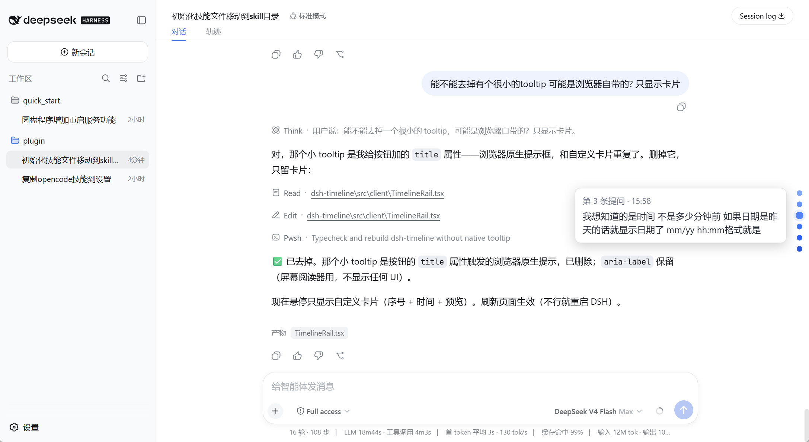

# dsh-timeline

<p align="center">
  <strong>简体中文</strong> | <a href="README.en.md">English</a>
</p>

[DeepSeek Harness](https://github.com/deepseek-ai/deepseek-harness) 的极简**提问时间线**插件：每条提问一个圆点，挂在界面右侧。点击圆点瞬间跳转到那条提问；悬停查看你当时说了什么、什么时候说的。



零配置、无 host 依赖、不查数据库——数据全部来自浏览器里已有的会话快照。

## 功能

- 🎯 **每条提问一个圆点** —— 所有用户提问在右侧细条上各有一个圆点
- 🔵 **安静默认** —— 圆点平时是灰色，高亮（悬停或正在阅读的段落）变蓝。状态全靠颜色表达，圆点永不放大，任何情况下都不会被裁剪
- 🌓 **深浅主题自适应** —— 圆点与预览气泡全部使用 DSH 设计令牌（`--dsw-alias-*` / `--dsw-static-*`），跟随浅色 / 深色 / 跟随系统切换，无需重启
- 📍 **分段高亮** —— 滚动对话时，视口底部所在的"提问+回答"段落对应的圆点亮蓝；位于对话底部时默认高亮最新一条
- 📜 **全历史覆盖** —— 长会话自动分页加载（`loadOlder`），直到整条对话的每个提问都有圆点，不只显示最近一页
- 📏 **任意长度都清爽** —— 同时最多显示 **15 个圆点**，更早的在内侧滚动查看（滚动条隐藏），圆点保持等距、不挤压变形
- 🖱 **跟随滚动** —— 滚出可见圆点后，圆点列自动跟随，高亮圆点始终在视野内
- ⚡ **点击跳转** —— 平滑滚动到对应消息，长对话不用再手动翻几百行
- 👁 **悬停预览** —— 显示提问序号、提问时间、前 80 字提问内容，以及 3 行 AI 回复摘要
- 🕐 **绝对时间** —— 今天的提问显示 `HH:MM`，昨天及更早显示 `MM/DD HH:MM`
- 🧹 **无滚动条** —— 对话页的垂直滚动条一并隐藏，位置由高亮圆点指示
- 🖱 **点击穿透** —— 时间条本身不挡对话，只有圆点响应点击
- 📦 **零足迹 host** —— node 半端是空 `apply`，服务端零开销
- 🔤 **无 i18n 负担** —— 文案仅中文，保持精简

## 安装

```sh
dsh plugin --profile web add github:zhangzheng25/dsh-timeline
```

重启 DSH，打开任意有提问的会话，右侧即出现时间线。

本地开发安装：

```sh
dsh plugin --profile web add link:E:/path/to/dsh-timeline   # link: 协议 → junction 链接，改代码 pnpm build 后刷新页面即生效
```

> ⚠️ 必须用 `link:` 协议：`file:` 协议在 profile 的 hoisted 模式下是**复制**目录，改代码不会生效。用 `link:` 后 `node_modules/dsh-timeline` 是指向本目录的 junction，构建产物直接可见，无需同步、无需重启。

## 原理

```
shell.overlay（root 作用域，附加式，点击穿透）
  └─ timeline.rail（自声明子槽，session 作用域）
       └─ useSession 快照 → chat.order + chat.nodes（kind === 'user'）
            → 圆点 → data-chat-anchor-key 行 → scrollIntoView
```

- **注入点**：全局 `shell.overlay` 席位，自声明会话级子槽 `timeline.rail`，Overlay 通过框架 `SessionProvider` 桥接到当前会话。
- **数据**：用户消息来自 `useSession` 快照（`chat.order` / `chat.nodes`），提问时间在 `data.time`（epoch 毫秒）——不读会话日志、不查数据库。
- **当前段落**：`useCurrentAnchor` 监听对话滚动容器，取视口底部之上最后一条用户行的 key——即读者所在的"提问+回答"段落，其圆点亮蓝。
- **跳转**：每条对话行带 `data-chat-anchor-key` 属性（值即节点 key），点圆点找到该行后 `scrollIntoView`。
- **UI**：时间条 `position: fixed` + `pointer-events: none`，只有圆点参与点击；圆点列表上限 15 个、内部滚动；列表和页面的滚动条都通过注入 CSS 隐藏。

## 开发

```sh
pnpm install
pnpm run typecheck   # tsc --noEmit
pnpm run build       # tsdown → lib/index.js（host）+ lib/client.js（浏览器）
```

构建产物（`lib/`）已提交，最终用户无需构建。改源码后：`pnpm run build`，重启 DSH（纯 client 改动刷新页面即可）。

> **远端安装（复制模式）注意**：如果插件是通过 `dsh plugin add` 在另一台机器/远端安装的，DSH 加载的是 profile 内的插件**副本**（`$DSH_HOME/profiles/web/node_modules/dsh-timeline`），不是本目录——本地改代码不会生效。改完代码后执行 `pnpm run sync:dsh` 把构建产物同步到副本（默认同步到 `web` profile，可用 `DSH_PROFILE` 环境变量指定其他 profile）。

**改代码后生效方式**（实测）：

| 改了什么 | 生效方式 |
|---|---|
| client 代码（`src/client/`，构建后 `lib/client.js`） | `pnpm run build` 后**刷新页面**即可，无需重启（DSH 对 `/plugins/<id>/client.js` 实时读文件、`no-cache`） |
| host 半端（`src/index.ts`）或 `cordis.patch.yml` | **必须重启 DSH**（启动时加载） |

## 技术要点

- TypeScript + [tsdown](https://github.com/rolldown/tsdown)，对齐官方 `clientBundle` 预设
- 槽位声明通过类型导入合并（`@deepseek-ai/dsh-client-ui-layout/client`、`@deepseek-ai/dsh-client-ui-conversation/client`）
- `dsh.client.inject` 声明 web loader 需要提供的运行时包
- tooltip 显式左对齐（button 的 UA 样式默认居中），并用 `width: max-content` 撑开宽度，避免绝对定位把文字挤成每字一行
- 圆点 `flex-shrink: 0` 防止 flex 布局把圆压成椭圆；tooltip 用 portal 渲染到 `document.body`（`overflow-y: auto` 的祖先会裁剪 absolute 子元素）
- 颜色零 JS 适配：圆点颜色直接引用 DSH 设计令牌（挂在 `body` 上，`body[data-ds-dark-theme]` 自动换肤）；悬浮卡片颜色由注入的样式表管理，浅色为白底、深色切换为黑底白字，令牌缺失时回退到原有配色

## 致谢

由 [dsh-milestone](https://github.com/SnowCrescenter-tech/dsh-milestone)（SnowCrescenter-tech）大幅精简而来——保留圆点、跳转与悬停预览，并新增分段高亮。

## 许可

MIT
